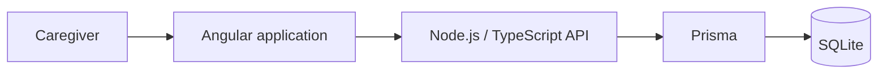

<div align="center">

**English** | [Português](README.pt-BR.md)

# CuidaBem Project

**Centralized elderly-care management for medical, dietary, routine and wellbeing needs.**

</div>

CuidaBem brings relevant care information into one application so caregivers can manage the patient's daily needs with a clearer and more consistent workflow.

## Architecture



## Technology overview

| Layer | Technology |
| --- | --- |
| Frontend | Angular |
| Backend | Node.js and TypeScript |
| Data access | Prisma |
| Local database | SQLite |
| API documentation | Swagger/OpenAPI |
| Authentication | Application authentication with environment-based secrets |

## Run locally

### Requirements

- Node.js 18 or newer
- npm 8 or newer

### Install dependencies

From the repository root:

```bash
npm run install:all
```

If the command is unavailable, install each application manually:

```bash
cd Back_end
npm install
cd ../Front-end
npm install
cd ..
```

### Configure the database

The backend uses a local SQLite database, generally created at `Back_end/prisma/dev.db`.

```bash
cd Back_end
npx prisma generate
npx prisma db push
npm run db:seed
cd ..
```

### Start the application

From the repository root:

```bash
npm run dev
```

This starts:

- Backend server: http://localhost:3000
- Angular frontend: http://localhost:8100

Open http://localhost:8100 to use CuidaBem.

## Data and security practices

Because this domain may involve personal and medical information:

- SQLite database files and `node_modules` are excluded from Git
- A newly cloned environment should generate a clean local database
- Passwords, API keys and JWT secrets must never be committed
- Sensitive values must be stored in a local `.env` file ignored by Git
- Real patient information must not be used as demonstration data
- Production deployments should apply access control, encryption, backups and retention policies appropriate to LGPD requirements

## Local database reset

To recreate a clean local environment, stop the applications, remove the local SQLite database and run the Prisma generation, schema and seed commands again. This permanently removes existing local data.
